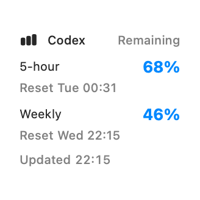
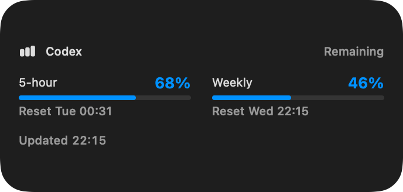

# CodexUsageMonitor

A minimal native macOS menu-bar and WidgetKit utility that displays the **remaining Codex 5-hour and weekly limits**, their reset times, and the last successful refresh. This is an independent open-source project, not affiliated with or endorsed by OpenAI.

**Version 0.1.4 is source-only.** Build it with Xcode and an installed official Codex CLI. No prebuilt or notarized application is distributed.

## Features

- Compact menu-bar indicator: `68%·46%` means 5-hour remaining, then weekly remaining.
- Five-hour and weekly windows with reset times and the last successful update.
- Small and Medium widgets for the desktop and Notification Center.
- Automatic polling about once per minute, manual refresh, and recovery after errors.
- English and Russian interface localization based on the macOS language, with light and dark appearances.
- Optional login launch, disabled by default.
- Separate quota groups; their percentages are never added together.

These **synthetic English previews** contain no account data:




The app must be running to obtain new data. After it quits, the widget may show its last saved snapshot. macOS controls WidgetKit refresh scheduling: **a one-minute app poll does not guarantee a one-minute widget redraw**.

## Architecture

```text
NSStatusItem + SwiftUI panel
    │ Process + pipes, newline-delimited JSON-RPC
    ▼
official codex app-server --stdio
    │ account/rateLimits/read + account/usage/read
    ▼
Normalized quota snapshot
    │ atomic JSON write to the dedicated local snapshot file
    ▼
Sandboxed WidgetKit extension (read-only consumer)
```

The client performs the required `initialize` / `initialized` handshake before either read method. It does not create conversations, start generation, sign in or out, or reset limits. It rejects server-initiated requests, including external token requests.

The **main app is not sandboxed** because it launches the installed Codex CLI with the current user's permissions. The extension is sandboxed and has no network entitlement. The main app's narrow code behavior does not reduce its operating-system file permissions.

Sharing requires **no Apple Account or App Group**. The main app writes one snapshot file:

```text
~/Library/Application Support/CodexUsageMonitor/usage-snapshot.json
```

The sandboxed widget receives an exact read-only file exception through `com.apple.security.temporary-exception.files.home-relative-path.read-only`. It cannot use that exception to read all of Application Support, Codex authentication storage, or write the snapshot. The directory is `0700` and the file is `0600`. This local-build arrangement does not imply Mac App Store approval.

The menu bar uses `NSStatusItem`; the panel and settings use SwiftUI. The compact panel stays below the menu bar and within the current display. Full labels for both percentages are available on hover and through accessibility. This also avoids a dynamic `MenuBarExtra` label loop observed on macOS 27.

The snapshot contains only the quota windows, remaining percentages, reset times, refresh/attempt timestamps, status, and selected quota-bucket ID. The token summary from `account/usage/read` remains in app memory for Settings; daily token history is not stored.

Windows are identified by `windowDurationMins` (300 / 10080), regardless of `primary` / `secondary` order. `rateLimitsByLimitId` takes precedence over legacy `rateLimits`. Missing data appears as `—`. Passing the reset time never turns stale data into an assumed 100%; a new service response is required.

## Security and network behavior

**This app and its widget:**

- Never read `~/.codex/auth.json` or other Codex authentication storage.
- Never request, store, transmit, or log access/refresh tokens.
- Have no backend, analytics, updater, or application-owned external network client.
- Launch the CLI directly with `Process` and fixed arguments, without a shell.
- Do not write raw RPC responses or CLI stderr to app logs or files. CLI stderr goes to the null device. macOS system diagnostics are outside the app's control. Widget logs contain only snapshot/window availability, not values, dates, tokens, or detailed errors.
- Limit each message to 1 MiB and each request to a 15-second timeout.
- Write the normalized snapshot atomically with `0600` file permissions, without account IDs or tokens.

**The official Codex CLI** owns the existing authentication and may contact OpenAI for fresh quota information. Fresh server-side limits cannot be obtained fully offline. Its network behavior and local files are determined by that CLI and OpenAI, not by this monitor.

The child process receives these overrides without changing the user's Codex configuration:

```text
analytics.enabled=false
otel.exporter="none"
otel.trace_exporter="none"
otel.metrics_exporter="none"
```

The child inherits only locale settings, an explicit HOME, and a fixed PATH. It does not inherit the user's PATH, CODEX_HOME, unknown variables, or token variables. A nonstandard CLI installation may need normal sign-in through the CLI's default storage; do not copy tokens into this app. With CLI 0.160.0, the monitor also sets `CODEX_INTERNAL_APP_SERVER_REMOTE_CONTROL_DISABLED=1` to disable an additional remote-control transport. That internal switch is version-specific, **not a stable protocol promise or a sandbox boundary**; repeat the live check after CLI updates.

A manually selected executable runs with your user permissions. Select only a trusted official Codex CLI installation.

## Requirements

- macOS 14 or later. The local end-to-end check was on macOS 27.0.1; earlier supported versions have not all been exercised.
- Xcode 15 or later with a macOS SDK. Local validation used Xcode 27.
- Official Codex CLI with `app-server` support. The validated CLI version was 0.160.0.
- ChatGPT/Codex authentication in the official CLI. An API-key-only account may not expose these limits.
- No paid Apple Developer team is needed for a local ad-hoc build.

No third-party Swift packages, CocoaPods, XcodeGen, or runtime libraries are required. The Xcode project is included.

## Build from source

Open `CodexUsageMonitor.xcodeproj`, select the **CodexUsageMonitor** scheme and **My Mac**.

For a compile-only Debug build without signing:

```sh
xcodebuild -project CodexUsageMonitor.xcodeproj \
  -scheme CodexUsageMonitor -configuration Debug \
  -derivedDataPath build CODE_SIGNING_ALLOWED=NO build
```

For a local ad-hoc Release build, use the audited script. It enables hardened runtime and verifies the app and widget signatures after compiling without provisioning:

```sh
bash Scripts/build-local.sh Release
```

Ad-hoc signing is for local use; it is not Developer ID signing or Apple notarization. See [validation results](VALIDATION.md). On the current machine, finish Debug builds and tests before installing Release: macOS can retain a development widget-extension registration. Xcode's local **Sign to Run Locally** option is also available. Distributing a prebuilt app to other Macs would require separate signing and Gatekeeper validation; this release distributes source only.

## Install and use locally

1. Run `bash Scripts/install-local.sh`, or place your locally built `build/Build/Products/Release/CodexUsageMonitor.app` in `~/Applications`.
2. Launch the app. Its icon and two percentages appear in the menu bar; it does not need a startup window or Dock icon.
3. If the CLI is not found, choose its official executable in Settings. Common Codex, ChatGPT, and Homebrew installation paths are checked automatically.
4. Choose **Edit Widgets** on the macOS desktop, find **CodexUsageMonitor**, and add a Small or Medium widget.
5. Click the widget to open the details panel and request a refresh.
6. Optionally enable launch at login in Settings. macOS may ask for approval in Login Items.

The monitor does not download the CLI or perform sign-in. If authentication is required, sign in through the official CLI.

### Empty widget after local builds

macOS may retain a Debug widget-extension path after a Release installation. Finish test builds **before** final installation, quit the app, then reinstall:

```sh
bash Scripts/install-local.sh --refresh-widget-host
```

The installer removes development registrations from the configured build directory, registers the installed extension, and, with this explicit option, restarts the current user's widget host. Other widgets may reload briefly; their preferences are not deleted. Close and reopen Notification Center afterward. Ordinary installation does not restart the host. If you use another build directory, set the same `CODEX_BUILD_DIR` for building and installing.

## Errors and freshness

- Data is stale after three minutes without a successful update.
- A failure does not replace percentages with zero or change the last successful timestamp.
- Retry delays are 60, then 120, then at most 300 seconds; successful polling returns to the normal cadence.
- The app attempts a refresh after the Mac wakes.
- A `usage/read` failure does not hide successfully obtained limits.
- An unsupported `usage/read` method is disabled until the next CLI connection.
- If the snapshot cannot be written, the menu keeps receiving data and reports a local-storage issue; the widget reports unavailable data.
- The widget never launches the CLI by itself when the app is closed.

## Validation

Core tests use a synthetic local app-server, without credentials or network access:

```sh
swift test
xcodebuild -project CodexUsageMonitor.xcodeproj \
  -scheme CodexUsageMonitor -destination 'platform=macOS' \
  -derivedDataPath build CODE_SIGNING_ALLOWED=NO test
```

The built app offers a live self-check without printing personal quota values:

```sh
build/Build/Products/Release/CodexUsageMonitor.app/Contents/MacOS/CodexUsageMonitor --self-check
```

It checks quota retrieval, local snapshot storage, and a read-back round trip. Token usage is checked separately and cannot block quota display. The command may update the local snapshot. Verify actual installed widget redraws separately.

`python3 Scripts/audit-source.py` checks the absence of app-owned network and credential APIs, the RPC allowlist, and minimal widget entitlements. See the [public security audit](SECURITY_AUDIT.md). GitHub Actions runs the guard, Swift tests, a Release build of the app and widget, and native Xcode tests. CI uses no personal authentication and cannot prove live installed-widget behavior.

## Release and contribution

This first public release contains source code only. No prebuilt app for other computers is claimed without Developer ID signing and notarization. See the [release process](RELEASE.md), [security policy](SECURITY.md), [privacy statement](PRIVACY.md), and [contributing guide](CONTRIBUTING.md). Report vulnerabilities privately, not through public issues.

## References

- [OpenAI app-server protocol](https://learn.chatgpt.com/docs/app-server).
- [OpenAI configuration reference](https://learn.chatgpt.com/docs/config-file/config-reference).
- [Apple: Keeping a widget up to date](https://developer.apple.com/documentation/widgetkit/keeping-a-widget-up-to-date).
- [Apple: File access temporary exceptions](https://developer.apple.com/library/archive/documentation/Miscellaneous/Reference/EntitlementKeyReference/Chapters/AppSandboxTemporaryExceptionEntitlements.html).

MIT License. Updates are installed manually from source; there is no automatic updater.
